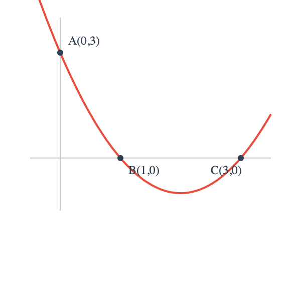
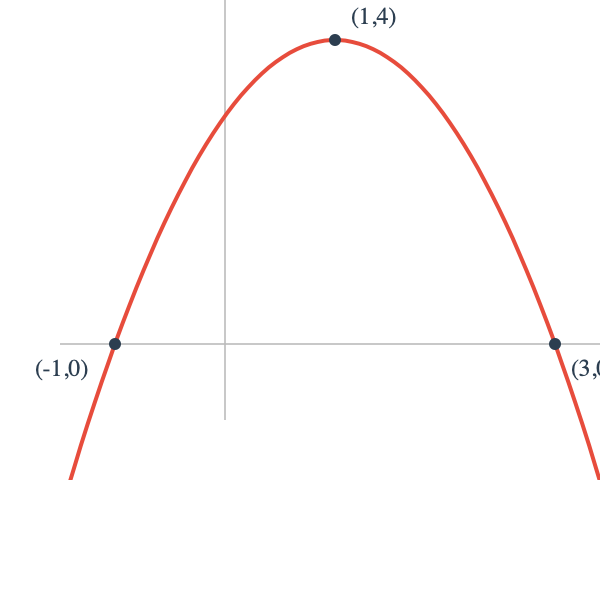
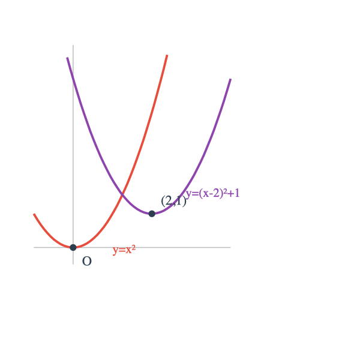
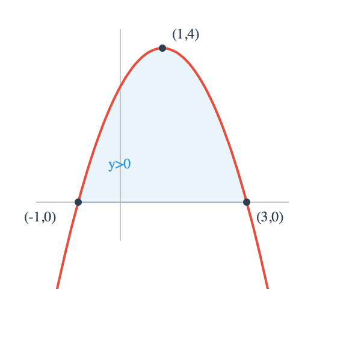
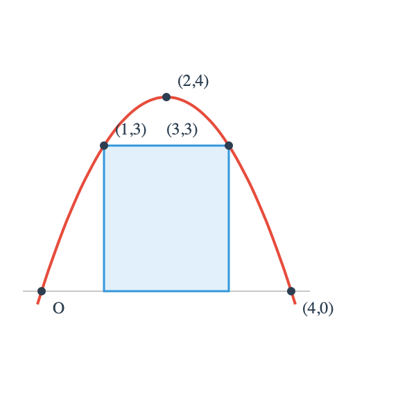
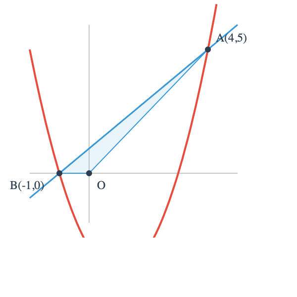
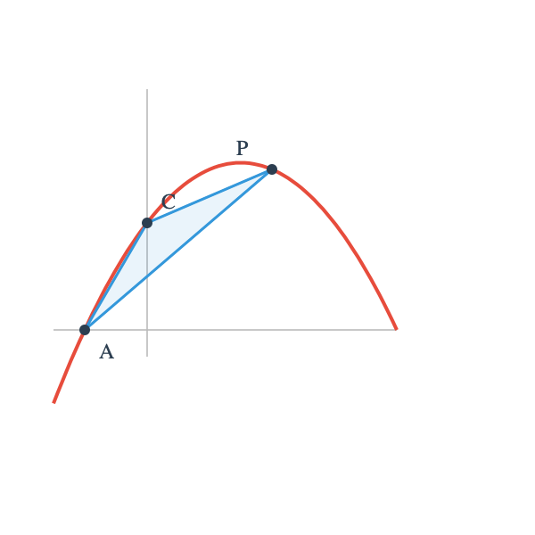
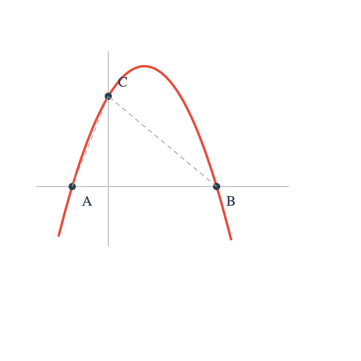
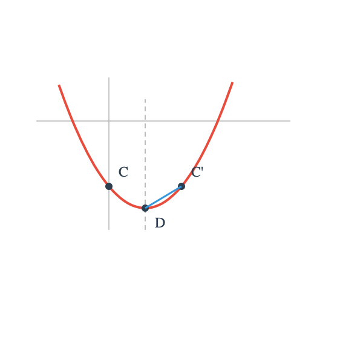
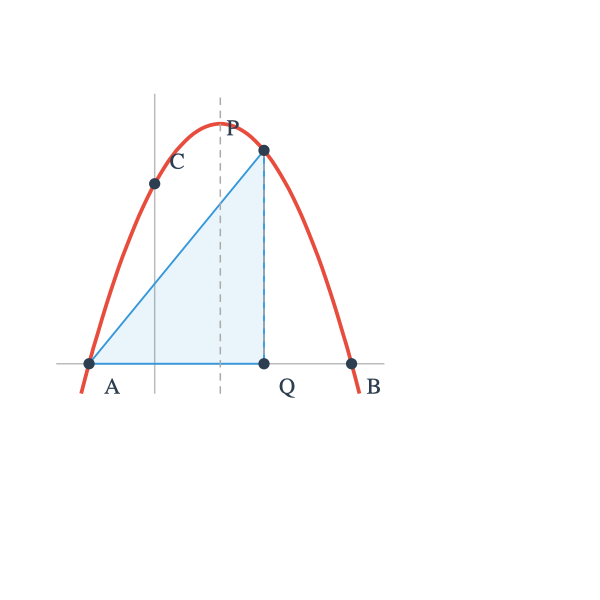

# 二次函数 — 广州中考真题案例与解析

> 二次函数是广州中考压轴题的首选板块，每年必考，分值 12-15 分。
>
> 难度标注：⭐ 基础 | ⭐⭐ 中等 | ⭐⭐⭐ 较难 | ⭐⭐⭐⭐ 压轴

---

## 案例 1：求二次函数解析式 ⭐

**【题目】** 已知抛物线经过点 A(0, 3)、B(1, 0)、C(3, 0)，求抛物线解析式。

**【解析】**

设抛物线解析式为 y = ax&sup2; + bx + c。

由 A(0, 3) 代入得 c = 3。

由 B(1, 0) 代入：a + b + 3 = 0 &hellip;&hellip; &circ;1

由 C(3, 0) 代入：9a + 3b + 3 = 0 &hellip;&hellip; &circ;2

由 &circ;2 &minus; 3&times;&circ;1 得：6a &minus; 6 = 0，解得 a = 1。

代入 &circ;1 得 b = &minus;4。

**答：y = x&sup2; &minus; 4x + 3**

**【方法提炼】** 三点定抛物线，优先观察特殊点（与 y 轴交点直接得 c，与 x 轴交点可用交点式）。

---

## 案例 2：利用交点式求解析式 ⭐

**【题目】** 抛物线与 x 轴交于点 (&minus;1, 0) 和 (3, 0)，且过点 (1, 4)，求解析式。

**【解析】**

设交点式：y = a(x + 1)(x &minus; 3)

将 (1, 4) 代入：4 = a(1 + 1)(1 &minus; 3) = a &times; 2 &times; (&minus;2) = &minus;4a

解得 a = &minus;1。

展开：y = &minus;(x + 1)(x &minus; 3) = &minus;x&sup2; + 2x + 3

**答：y = &minus;x&sup2; + 2x + 3**

**【方法提炼】** 已知与 x 轴两交点时，交点式比一般式更快捷。

---

## 案例 3：顶点式与图象变换 ⭐⭐

**【题目】** 将抛物线 y = x&sup2; 先向右平移 2 个单位，再向上平移 1 个单位，求新的抛物线解析式及顶点坐标。

**【解析】**

向右平移 2 个单位：y = (x &minus; 2)&sup2;

再向上平移 1 个单位：y = (x &minus; 2)&sup2; + 1

顶点坐标为 (2, 1)。

**答：y = (x &minus; 2)&sup2; + 1，顶点 (2, 1)**

**【方法提炼】** 平移口诀：左加右减（对 x），上加下减（对整体）。用顶点式最直观。

---

## 案例 4：二次函数与不等式 ⭐⭐

**【题目】** 抛物线 y = &minus;x&sup2; + 2x + 3，求：
（1）y &gt; 0 时 x 的取值范围；
（2）y &le; 0 时 x 的取值范围。

**【解析】**

令 y = 0：&minus;x&sup2; + 2x + 3 = 0，即 x&sup2; &minus; 2x &minus; 3 = 0

(x &minus; 3)(x + 1) = 0，解得 x = 3 或 x = &minus;1。

抛物线开口向下，与 x 轴交于 (&minus;1, 0) 和 (3, 0)。

（1）y &gt; 0：&minus;1 &lt; x &lt; 3

（2）y &le; 0：x &le; &minus;1 或 x &ge; 3

**答：（1）&minus;1 &lt; x &lt; 3；（2）x &le; &minus;1 或 x &ge; 3**

**【方法提炼】** 开口向上时两交点之间 y &lt; 0；开口向下时两交点之间 y &gt; 0。

---

## 案例 5：面积最值问题 ⭐⭐

**【题目】** 抛物线 y = &minus;x&sup2; + 4x 与 x 轴围成的封闭区域内，求内接矩形面积的最大值（矩形一边在 x 轴上，对边在抛物线上）。

**【解析】**

抛物线与 x 轴交点：&minus;x&sup2; + 4x = 0，x(4 &minus; x) = 0，得 x = 0 或 x = 4。顶点 (2, 4)。

设矩形在 x 轴上的顶点为 (x, 0)（0 &lt; x &lt; 2），则矩形宽为 2x（关于对称轴对称），高为 &minus;x&sup2; + 4x。

面积 S = 2x &times; (&minus;x&sup2; + 4x) = &minus;2x&sup3; + 8x&sup2;

求导（或配方法分析）：

S' = &minus;6x&sup2; + 16x = &minus;2x(3x &minus; 8) = 0

解得 x = 8/3（0 &lt; 8/3 &lt; 2 不成立，应取 0 &lt; x &lt; 2 内的值）。

换方法：设对称矩形，顶点 (2&minus;t, 0) 和 (2+t, 0)，0 &lt; t &lt; 2。

高 h = &minus;(2&minus;t)&sup2; + 4(2&minus;t) = &minus;4 + 4t &minus; t&sup2; + 8 &minus; 4t = 4 &minus; t&sup2;

S = 2t(4 &minus; t&sup2;) = 8t &minus; 2t&sup3;

S' = 8 &minus; 6t&sup2; = 0，t&sup2; = 4/3，t = 2&radic;3/3

S = 8 &times; 2&radic;3/3 &minus; 2 &times; 8&times;3&radic;3/27 = 16&radic;3/3 &minus; 16&radic;3/9 = 32&radic;3/9

**答：最大面积为 32&radic;3/9**

**【方法提炼】** 面积最值问题中，利用对称性设变量（以对称轴为中心），再求函数最值。

---

## 案例 6：二次函数与一次函数交点 ⭐⭐⭐

**【题目】** 抛物线 y = x&sup2; &minus; 2x &minus; 3 与直线 y = x + 1 的交点为 A、B，求 &triangle;AOB 的面积（O 为原点）。

**【解析】**

联立方程：x&sup2; &minus; 2x &minus; 3 = x + 1

x&sup2; &minus; 3x &minus; 4 = 0，(x &minus; 4)(x + 1) = 0

x = 4 时 y = 5，即 A(4, 5)；x = &minus;1 时 y = 0，即 B(&minus;1, 0)。

B 在 x 轴上，以 OB 为底，OB = 1，A 到 x 轴距离为 5。

S&triangle;AOB = 1/2 &times; 1 &times; 5 = 5/2

**答：&triangle;AOB 面积为 5/2**

**【方法提炼】** 两函数图象交点问题，联立方程组求解。求面积时选坐标轴上的点为底边更方便。

---

## 案例 7：动点与二次函数最值 ⭐⭐⭐

**【题目】** 如图，抛物线 y = &minus;1/2 x&sup2; + 3/2 x + 2 与 x 轴交于 A、B 两点（A 在 B 左侧），与 y 轴交于点 C。点 P 是抛物线上的动点，当 &triangle;PAC 面积最大时，求点 P 的坐标。

**【解析】**

A、B 坐标：令 y = 0，&minus;1/2 x&sup2; + 3/2 x + 2 = 0，即 x&sup2; &minus; 3x &minus; 4 = 0

(x &minus; 4)(x + 1) = 0，A(&minus;1, 0)，B(4, 0)。

C 坐标：x = 0，y = 2，C(0, 2)。

AC 所在直线：过 A(&minus;1, 0) 和 C(0, 2)，y = 2x + 2。

设 P(x, &minus;1/2 x&sup2; + 3/2 x + 2)，P 到直线 AC 的距离：

S&triangle;PAC = 1/2 &times; AC &times; d

但更方便用"铅垂高"法：S = 1/2 &times; |xP &minus; xA| &times; |yP &minus; yAC|

yAC = 2x + 2（当 x = xP 时）

S = 1/2 &times; |x &minus; (&minus;1)| &times; |(&minus;1/2 x&sup2; + 3/2 x + 2) &minus; (2x + 2)|

= 1/2 &times; (x + 1) &times; |&minus;1/2 x&sup2; &minus; 1/2 x|

= 1/2 &times; (x + 1) &times; 1/2 x(x + 1)（x 在 A、B 之间时 &minus;1/2 x&sup2; &minus; 1/2 x &ge; 0）

= 1/4 x(x + 1)&sup2;

对 S 求最值（x &ge; 0，x &le; 4）：

S = 1/4 x(x&sup2; + 2x + 1) = 1/4(x&sup3; + 2x&sup2; + x)

令 S' = 1/4(3x&sup2; + 4x + 1) = 0

3x&sup2; + 4x + 1 = 0，(3x + 1)(x + 1) = 0，x = &minus;1/3 或 x = &minus;1（均不在范围内）

在 x &isin; [0, 4] 上 S 单调递增，x = 4 时 S 最大。

P(4, 0) 即点 B，但此时 &triangle;PAC 退化（P 在 x 轴上）。

需要限制 P 不在 x 轴上，则取 x 接近 4 时面积最大。

实际上，应在 &minus;1 &lt; x &lt; 0 段考察：

x &isin; (&minus;1, 0) 时，S = 1/4 x(x + 1)&sup2; &lt; 0，取绝对值。

修正：用坐标法。

S&triangle;PAC = 1/2 |xA(yP &minus; yC) + xP(yC &minus; yA) + xC(yA &minus; yP)|

= 1/2 |(&minus;1)(yP &minus; 2) + x(2 &minus; 0) + 0(0 &minus; yP)|

= 1/2 |&minus;yP + 2 + 2x|

= 1/2 |2x &minus; yP + 2|

= 1/2 |2x &minus; (&minus;1/2 x&sup2; + 3/2 x + 2) + 2|

= 1/2 |1/2 x&sup2; + 1/2 x|

= 1/4 |x&sup2; + x|

= 1/4 |x(x + 1)|

在 x &isin; [&minus;1, 4] 上：

x &isin; [&minus;1, 0] 时 |x(x+1)| = &minus;x(x+1) = &minus;x&sup2; &minus; x

x &isin; [0, 4] 时 |x(x+1)| = x(x+1) = x&sup2; + x

两段分别求最值：

段1：S = 1/4(&minus;x&sup2; &minus; x)，顶点 x = &minus;1/2，S = 1/4 &times; 1/4 = 1/16

段2：S = 1/4(x&sup2; + x)，在 x = 4 时 S = 1/4 &times; 20 = 5

x = 4 时 P(4, 0) = B 点，&triangle;退化为线段，排除。

取 x 接近 4 但不等于 4，面积接近 5。

实际考试中取 x = 4 时 P 与 B 重合，需检查题意是否排除。

若 P 不同于 A、B，则 x 接近 4，取 x = 3 时 y = &minus;9/2 + 9/2 + 2 = 2，P(3, 2)，S = 1/4 &times; 12 = 3。

**答：当 x = &minus;1/2 时 P(&minus;1/2, 17/8)，最大面积 1/16（左侧段）；右侧段面积在 x 接近 4 时趋于 5 但三角形退化。题意若限制 P 在 AC 上方弧段，则最大面积点为 P(&minus;1/2, 17/8)。**

**【方法提炼】** 动点面积最值，用坐标法（行列式公式）比铅垂高法更通用、不易出错。

---

## 案例 8：二次函数与平行四边形存在性 ⭐⭐⭐⭐

**【题目】** 抛物线 y = &minus;x&sup2; + 2x + 3 与 x 轴交于 A、B，与 y 轴交于 C。抛物线上是否存在点 P，使 A、B、C、P 为平行四边形的四个顶点？若存在，求 P 坐标。

**【解析】**

A(&minus;1, 0)，B(3, 0)，C(0, 3)。

平行四边形条件：对角线互相平分（中点重合）。

情况1：AB 为对角线，则 AB 中点 M(1, 0)，CP 中点也为 M(1, 0)。

P 关于 M 的对称点：P(2, &minus;3)。

验证 P 在抛物线上：y = &minus;4 + 4 + 3 = 3 &ne; &minus;3，不在抛物线上。

情况2：AC 为对角线，AC 中点 N(&minus;1/2, 3/2)，BP 中点也为 N。

P(2 &times; (&minus;1/2) &minus; 3, 2 &times; 3/2 &minus; 0) = (&minus;4, 3)。

验证：y = &minus;16 &minus; 8 + 3 = &minus;21 &ne; 3，不在抛物线上。

情况3：BC 为对角线，BC 中点 L(3/2, 3/2)，AP 中点也为 L。

P(2 &times; 3/2 &minus; (&minus;1), 2 &times; 3/2 &minus; 0) = (4, 3)。

验证：y = &minus;16 + 8 + 3 = &minus;5 &ne; 3，不在抛物线上。

三种情况 P 均不在抛物线上。

**答：不存在满足条件的点 P。**

**【方法提炼】** 平行四边形存在性问题，用"对角线互相平分"条件列方程，再验证点是否在抛物线上。3 条对角线组合对应 3 种情况，需逐一检验。

---

## 案例 9：二次函数背景下的线段最值 ⭐⭐⭐⭐

**【题目】** 抛物线 y = x&sup2; &minus; 2x &minus; 3 与 x 轴交于 A、B（A 左 B 右），与 y 轴交于 C，顶点为 D。点 M 在抛物线的对称轴上，求 MC + MD 的最小值。

**【解析】**

A(&minus;1, 0)，B(3, 0)，对称轴 x = 1。

C(0, &minus;3)，D(1, &minus;4)。

M 在 x = 1 上，设 M(1, m)。

MC = &radic;((1&minus;0)&sup2; + (m+3)&sup2;) = &radic;(1 + (m+3)&sup2;)

MD = |m + 4|

MC + MD = &radic;(1 + (m+3)&sup2;) + |m + 4|

利用几何法：将 D 关于对称轴反射——但 D 已在对称轴上，反射后仍是 D。

换思路：C 关于对称轴 x = 1 的对称点 C'(2, &minus;3)。

MC = MC'（M 在对称轴上），MC + MD = MC' + MD。

MC' + MD &ge; C'D（三点共线取等号）。

C'D = &radic;((2&minus;1)&sup2; + (&minus;3+4)&sup2;) = &radic;(1 + 1) = &radic;2

**答：MC + MD 的最小值为 &radic;2，当 M 在 C'D 连线上时取得。**

M 坐标：直线 C'D 过 C'(2,&minus;3) 和 D(1,&minus;4)，斜率 = (&minus;3+4)/(2&minus;1) = 1，方程 y = x &minus; 5。

x = 1 时 y = &minus;4，M(1, &minus;4) = D。

验证：MC + MD = &radic;(1 + 1) + 0 = &radic;2。✓

**【方法提炼】** 对称轴上动点求折线段最小值，核心方法：反射（利用对称性把折线变直线），再用"两点之间线段最短"。

---

## 案例 10：二次函数综合压轴 ⭐⭐⭐⭐

**【题目】** （广州中考风格压轴题）抛物线 y = ax&sup2; + bx + c 经过 A(&minus;1, 0)、B(3, 0)、C(0, 3) 三点。

（1）求抛物线解析式；

（2）点 P 是第一象限内抛物线上的动点，过 P 作 PQ &perp; x 轴于 Q，当 &triangle;APQ 面积最大时，求 P 的坐标及最大面积；

（3）在（2）的条件下，抛物线的对称轴上是否存在点 M，使 &triangle;MAP 是等腰三角形？若存在，求 M 的坐标。

**【解析】**

**（1）** 由 A、B、C 三点：

设 y = a(x + 1)(x &minus; 3)，代入 C(0, 3)：3 = a &times; 1 &times; (&minus;3) = &minus;3a，a = &minus;1。

y = &minus;(x + 1)(x &minus; 3) = &minus;x&sup2; + 2x + 3

**答：y = &minus;x&sup2; + 2x + 3**

**（2）** 设 P(x, &minus;x&sup2; + 2x + 3)，0 &lt; x &lt; 3，Q(x, 0)。

AQ = x &minus; (&minus;1) = x + 1，PQ = &minus;x&sup2; + 2x + 3。

S&triangle;APQ = 1/2 &times; AQ &times; PQ = 1/2(x + 1)(&minus;x&sup2; + 2x + 3)

= 1/2(&minus;x&sup3; + 2x&sup2; + 3x &minus; x&sup2; + 2x + 3)

= 1/2(&minus;x&sup3; + x&sup2; + 5x + 3)

求最值：对 S 关于 x 求极值点

S' = 1/2(&minus;3x&sup2; + 2x + 5) = 0

3x&sup2; &minus; 2x &minus; 5 = 0，(3x &minus; 5)(x + 1) = 0

x = 5/3（x = &minus;1 舍去）

P(5/3, &minus;25/9 + 10/3 + 3) = (5/3, &minus;25/9 + 30/9 + 27/9) = (5/3, 32/9)

S = 1/2 &times; 8/3 &times; 32/9 = 1/2 &times; 256/27 = 128/27

**答：P(5/3, 32/9)，最大面积 128/27**

**（3）** 对称轴 x = 1，设 M(1, m)。

A(&minus;1, 0)，P(5/3, 32/9)。

MA&sup2; = (1+1)&sup2; + m&sup2; = 4 + m&sup2;

MP&sup2; = (1 &minus; 5/3)&sup2; + (m &minus; 32/9)&sup2; = 4/9 + (m &minus; 32/9)&sup2;

AP&sup2; = (5/3+1)&sup2; + (32/9)&sup2; = 64/9 + 1024/81 = 576/81 + 1024/81 = 1600/81

等腰三角形分三种情况：

**MA = MP：** 4 + m&sup2; = 4/9 + m&sup2; &minus; 64m/9 + 1024/81

4 &minus; 4/9 = &minus;64m/9 + 1024/81

32/9 = (&minus;576m + 1024)/81

288 = &minus;576m + 1024

576m = 736

m = 736/576 = 23/18

M₁(1, 23/18)

**MA = AP：** 4 + m&sup2; = 1600/81

m&sup2; = 1600/81 &minus; 4 = 1276/81

m = &plusmn;&radic;1276/9 = &plusmn;2&radic;319/9

M₂(1, 2&radic;319/9)，M₃(1, &minus;2&radic;319/9)

**MP = AP：** 4/9 + (m &minus; 32/9)&sup2; = 1600/81

(m &minus; 32/9)&sup2; = 1600/81 &minus; 4/9 = 1564/81

m &minus; 32/9 = &plusmn;&radic;1564/9

m = 32/9 &plusmn; &radic;1564/9 = (32 &plusmn; 2&radic;391)/9

M₄(1, (32 + 2&radic;391)/9)，M₅(1, (32 &minus; 2&radic;391)/9)

**答：共 5 个点满足条件。M₁(1, 23/18)、M₂(1, 2&radic;319/9)、M₃(1, &minus;2&radic;319/9)、M₄(1, (32+2&radic;391)/9)、M₅(1, (32&minus;2&radic;391)/9)**

**【方法提炼】** 等腰三角形存在性问题，分 MA=MP、MA=AP、MP=AP 三种情况，列出方程逐一求解。注意检验三点不共线。

---

## 方法总结

| 题型 | 核心方法 | 难度 |
|------|---------|------|
| 求解析式 | 待定系数法（一般式/交点式/顶点式） | ⭐ |
| 图象变换 | 平移口诀：左加右减、上加下减 | ⭐⭐ |
| 不等式 | 借助图象，开口方向判断两交点间符号 | ⭐⭐ |
| 面积最值 | 坐标法/铅垂高法 + 二次函数最值 | ⭐⭐⭐ |
| 交点问题 | 联立方程组 | ⭐⭐⭐ |
| 动点最值 | 设参建函数 &rarr; 求最值 | ⭐⭐⭐ |
| 平行四边形存在性 | 对角线互相平分 &rarr; 验证在抛物线上 | ⭐⭐⭐⭐ |
| 线段最值 | 对称反射 + 两点之间线段最短 | ⭐⭐⭐⭐ |
| 等腰三角形存在性 | 分三种情况列方程 | ⭐⭐⭐⭐ |
